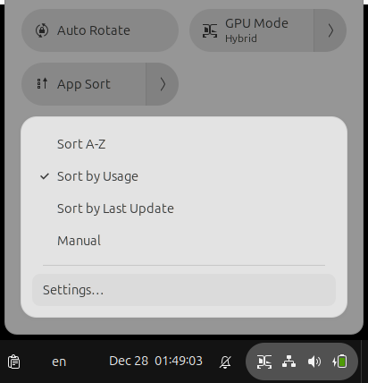

# App Grid Sorter

A minimal GNOME Shell extension to sort app grid.



## Features

- **Multiple Sort Modes**  
  - A-Z - Alphabetical order
  - By Usage - Most used apps first
  - By Last Update - Newest installed/modified first
  - Manual - Default drag-and-drop
- **Quick Settings Toggle** - Toggle sort modes directly from Quick Settings. Can be disabled if you'd prefer using only the Plugin Settings.

## Usage

**Via Quick Settings:**
1. Open Quick Settings (click top-right corner)
2. Click "App Sort"
3. Choose: Sort A-Z, Sort by Usage, Sort by Last Update, or Manual
4. Click "Settings…" to open preferences

**Via Settings:**
1. Open Extensions app
2. Find "App Grid Sorter"
3. Click the gear icon
4. Choose sort mode and toggle Quick Settings visibility
5. Optionally, enable or disable the Quick Settings toggle

## Requirements

- GNOME Shell 45, 46, 47, or 48

## Development workflow

Build and install:

```bash
./build.sh
./install.sh
```

Then log out and back in (Wayland) or press Alt+F2 → `r` (X11).

Uninstall with:

```bash
./uninstall.sh
```

Some CLI commands:

```bash
# View logs
journalctl -f /usr/bin/gnome-shell | grep -i sort

# Set mode via CLI
gsettings set org.gnome.shell.extensions.app-grid-sorter sort-mode 'alphabetical'
gsettings set org.gnome.shell.extensions.app-grid-sorter sort-mode 'usage'
gsettings set org.gnome.shell.extensions.app-grid-sorter sort-mode 'date-added'
gsettings set org.gnome.shell.extensions.app-grid-sorter sort-mode 'manual'

# Toggle Quick Settings visibility
gsettings set org.gnome.shell.extensions.app-grid-sorter show-in-quick-settings true
```

## Credits

Inspired by:
- [Alphabetical App Grid](https://github.com/stuarthayhurst/alphabetical-grid-extension)
- [App Grid Wizard](https://github.com/MahdiMirzadeh/app-grid-wizard)

## License

GPL-3.0
